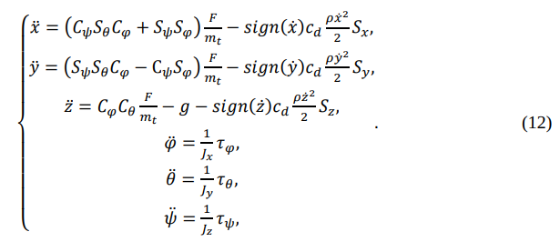
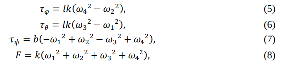

# Quadcopter

### Система уравнений, описывающая движение квадрокоптера.
Первые три уравнения -- законы поступательного движения (вторые законы Ньютона).
Последние три уравнения -- законы вращательного движения.

где

