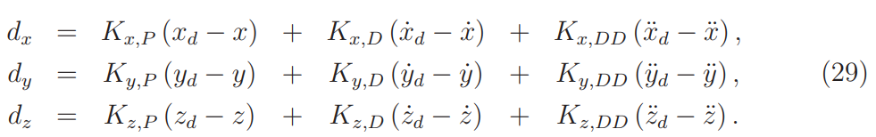
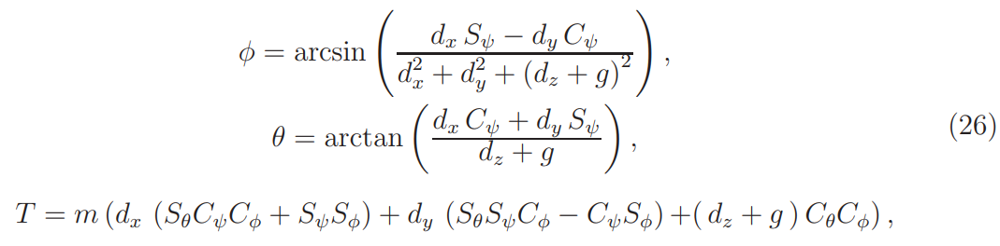
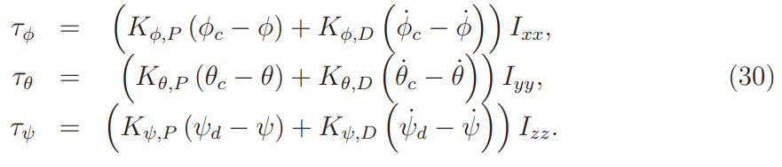
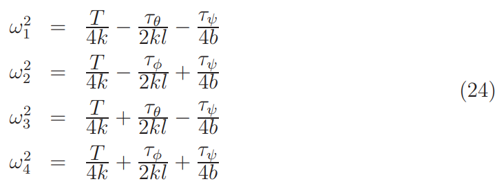

# Quadcopter

## Система уравнений, описывающая движение квадрокоптера.
Первые три уравнения -- законы поступательного движения (вторые законы Ньютона).
Последние три уравнения -- законы вращательного движения.

где

## Integrated PD controller

Current coordinates: x, y, z  
Desired coordinates: xd, yd, zd  
Current angles: φ, θ, ψ  
Let desired angles be zeros: φd = θd = ψd = 0  

##### Calculate deltas

##### Calculate commanded angles φc and θc and thrust T

##### Calculate torques

##### Calculate control inputs (angular velocities of engines)

## Finding controller's parameters by Genetic algorithm

##### Genotype
genotype = {KxP, KyP, KzP, KφP, KθP, KψP, KxD, KyD, KzD, KφD, KθD, KψD, KxDD, KyDD, KzDD}

##### Loss function
|x - x_a| + |y - y_a| + |z - z_a| -> min  
x_a(t) = kt if t <= T else kT  
where k = x_d / T, T -- flight time

### References
* [Modelling and control of quadcopter](http://sal.aalto.fi/publications/pdf-files/eluu11_public.pdf)
* [Инженерный вестник](res/Gurianov.pdf)
* [ДИССЕРТАЦИЯ на соискание степени МАГИСТРА](http://elib.spbstu.ru/dl/2/v17-5857.pdf/download/v17-5857.pdf)
